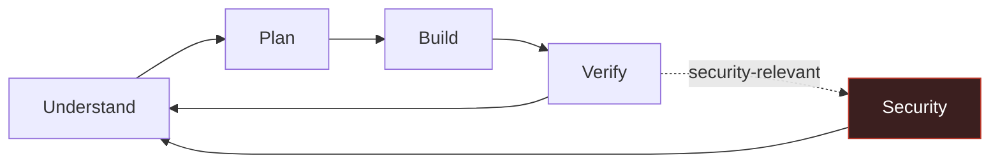

<div align="center">

# Claude Harness

**A portable skill-and-rules pack for AI coding agents — advisory, not a state machine.**

[](LICENSE)
[](skills/manifest.yaml)
[](#quick-start)
[](statusline/README.md)

</div>

Most agent harnesses try to control the agent: phase gates, edit ceilings, verifier artifacts you have to produce to prove you didn't skip a step. Claude Harness assumes the opposite — a well-briefed agent doesn't need a cage, it needs good judgment, good defaults, and a memory that gets smarter instead of bigger. Nothing here is a plugin you install to get "control back," it's context you hand the agent.

> [!NOTE]
> **Claude Code is the fully-installed target** — `install.sh` wires rules, skills, memory, and the statusline into `~/.claude`. Cursor and Codex aren't wired up yet: no `adapters/cursor/`, no root `AGENTS.md` ship in this repo today. Everything under `rules/` is plain markdown, though — paste `rules/security-invariants.md` into `.cursor/rules/` or an `AGENTS.md` yourself if you're on one of those.

---

## Quick start

```bash
git clone https://github.com/syed-hassan7/claude-harness
cd claude-harness
./install.sh
```

Idempotent — safe to re-run after `git pull`. That's rules, skills catalog, memory spec, and the statusline, all wired into `~/.claude` in one command. Add `--with-memory-hooks` when you're ready for automatic session checkpoints (opt-in, see [below](#using-it-today)).

<div align="center">

**[The loop](#the-loop) · [What makes this different](#four-things-that-make-this-different) · [Statusline](#statusline--the-one-piece-thats-not-just-a-spec) · [What's inside](#whats-inside) · [Why not X?](#why-not-just-use-gated-harness--claude-mem--claude-reflect) · [Full install guide](#using-it-today) · [Provenance](#provenance)**

</div>

---

## The loop



No step is mechanically blocked. Skip what doesn't apply, revisit what needs it, do two steps in one turn — judgment, not a phase stored in a state file. **Security is the one thing that's never optional**: it runs on every turn regardless of where you are in the loop.

## Four things that make this different

<table>
<tr>
<td width="50%" valign="top">

### Learns from being wrong

Corrections and disproportionate-effort incidents ("this should've taken 30 seconds, it took 10 tool calls") become durable lessons — but only after the agent runs a criticality check on itself first. You correcting it wrongly doesn't get silently encoded as gospel.

</td>
<td width="50%" valign="top">

### Vetted, not vibed

Every skill in `skills/manifest.yaml` carries a star count, license, and vet date — and the failures are logged too: two fabricated citations caught and excluded mid-research, real Windows bugs cited by issue number, popular tools named as cautionary anti-examples where they deserved it.

</td>
</tr>
<tr>
<td width="50%" valign="top">

### Zero context bloat

Session memory and lesson memory are both index-then-detail: a one-line pointer loads every time, full content loads only when something actually needs it. Compare to harnesses that dump every learned rule into context at session start.

</td>
<td width="50%" valign="top">

### Portable by construction

Rules are plain markdown, skills are a YAML contract, memory is files-on-disk. No daemon, no database, no vendor lock-in to one agent's plugin format.

</td>
</tr>
</table>

## Statusline — the one piece that's not just a spec

Everything else here is context an agent reads. This is the one thing *you* look at: model, color-coded context %, directory + git branch, session duration, effort level, and both rate-limit windows — each with a plain countdown to when it resets, not just a bar that fills up with no sense of when it lets go.

```
Sonnet 5 │ Context Window: 34% │ claude-harness (main*) │ ⏱ 1h12m │ ● high

current ●●●●○○○○○○  34% ⟳ resets in - 2 hrs 3 mins
weekly  ●●○○○○○○○○  28% ⟳ resets in - 5 days 3 hrs
```

`./install.sh` wires this up automatically. Full field-by-field breakdown, the jq dependency, and what happens if it's missing (an honest one-line error now, not fabricated-looking data) in [`statusline/README.md`](statusline/README.md). Two minutes, immediately visible, no adoption curve.

## What's inside

<details>
<summary><strong>Expand the full directory layout</strong></summary>

```
rules/
├── engineering.md          Ponytail YAGNI baseline + debugging, review, static
│                           analysis, dependency hygiene, perf, planning,
│                           architecture review, testability design
├── design-lane.md          UI/UX sequence — triggered by task shape, not always-on
└── security-invariants.md  One always-on invariant set, every session, every surface

memory/
├── SPEC.md                 Automatic dual-scope session checkpoints +
│                           mistake-memory (the self-learning layer above)
├── templates/              checkpoint.md, lesson.md schemas
└── hooks/                  Working, opt-in hook implementation — see
                             "Using it today" below (install.sh --with-memory-hooks)
    └── test/run.sh         22-case suite incl. Windows lockfile concurrency,
                             archive trim boundaries, stale-lock reclaim —
                             run after touching anything under memory/hooks/

skills/
├── manifest.yaml           48+ skills, 12 categories, portable contract
└── RESEARCH.md             The sourced, spot-checked research trail — read this
                            when you don't want to take the manifest on faith

statusline/
├── statusline.sh            Drop-in ~/.claude/statusline.sh — see section above
├── README.md                Setup + what each field means
└── test.sh                  Regression test — run after touching statusline.sh

install.sh                  Idempotent installer — pack files -> ~/.claude/claude-harness/,
                             statusline -> ~/.claude/statusline.sh, marked pointer
                             block -> ~/.claude/CLAUDE.md. See "Using it today" below.
WORKFLOW.md                 The loop above, in full
CLAUDE_HARNESS_ANALYSIS.md  Historical planning doc — analyzes the separate
                             machina v4 repo's demolition (never executed);
                             not this repo's own file history
```

</details>

## Why not just use \[gated harness / claude-mem / claude-reflect\]?

| | Phase-gated harnesses | Context-dumping memory tools | Claude Harness |
|---|:---:|:---:|:---:|
| Blocks a tool call on a missing artifact | ✅ Yes | ❌ — | ❌ **Never** |
| Loads every learned rule at session start | ❌ — | ✅ Yes | ❌ **No** — index first, detail on demand |
| Silently trusts every correction as valid | ❌ — | ⚠️ Usually | ❌ **No** — criticality check before it's written down |
| Every pick independently vetted | ⚠️ Rarely | ⚠️ Rarely | ✅ **Yes** — `skills/RESEARCH.md` |

## Using it today

```bash
./install.sh                    # rules + skills catalog + memory spec + statusline
./install.sh --with-memory-hooks  # ^ plus automatic session checkpoints (opt-in)
```

Copies `rules/`, `skills/`, `memory/`, and `WORKFLOW.md` into a namespaced `~/.claude/claude-harness/` (never touches `~/.claude/skills/` or `~/.claude/memory/` directly — those are host-owned, live directories), installs the statusline script, and writes a single marked, re-runnable pointer block into `~/.claude/CLAUDE.md` — the one file Claude Code actually auto-loads every session.

> [!IMPORTANT]
> What it deliberately does **not** do:
>
> - **Doesn't touch `settings.json`.** That file holds your existing hooks config — auto-editing structured JSON next to hooks you already depend on is a real corruption risk for no real benefit. If no `statusLine` block is found, the script prints the exact JSON to add by hand (see `statusline/README.md`). The same applies to `--with-memory-hooks`: it copies the hook files and prints the settings.json snippet, but you paste it in yourself.
> - **Doesn't copy `rules/security-invariants.md` verbatim into `CLAUDE.md`.** If your `CLAUDE.md` already has hand-written security rules, a blind verbatim append duplicates them under different wording — the opposite of this pack's zero-context-bloat pitch. The pointer block links to the canonical file instead; dedupe your existing prose against it yourself, on your own schedule.
> - **Doesn't install memory hooks by default even with the flag copied.** They fire on every single Edit/Write once wired — new code, tested (22 cases incl. Windows lockfile concurrency, archive trim boundaries, stale-lock reclaim — see `memory/SPEC.md`), but "tested" and "proven in production" aren't the same claim. Wire them when you're ready, not because a flag exists.

For Cursor/Codex, or if you'd rather not run a script: everything above still applies by hand — point `AGENTS.md`/`.cursor/rules/` at `rules/security-invariants.md`, reference `rules/engineering.md` + `rules/design-lane.md` + `skills/manifest.yaml`, and treat `memory/SPEC.md` as the memory-layer spec.

## Provenance

Nothing in `skills/manifest.yaml` or `rules/` is asserted without a source. `skills/RESEARCH.md` has the full trail — stars, licenses, issue numbers, and the citations that didn't survive verification and were cut. If you're going to trust a pack of rules an agent reads every session, that trail is the part worth reading first.

<div align="center">

---

Licensed under [MIT](LICENSE) · Built for Claude Code, adaptable everywhere else

</div>
