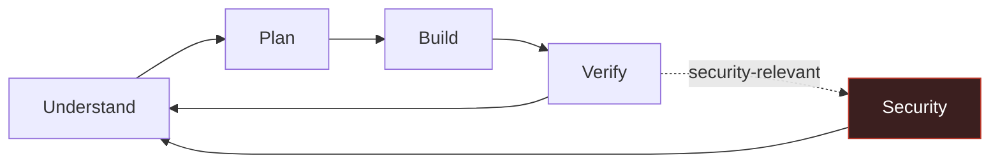

# Claude Harness

**A portable skill-and-rules pack for AI coding agents — advisory, not a state machine.**

Most agent harnesses try to control the agent: phase gates, edit ceilings, verifier artifacts you have to produce to prove you didn't skip a step. Claude Harness assumes the opposite — a well-briefed agent doesn't need a cage, it needs good judgment, good defaults, and a memory that gets smarter instead of bigger. Works with Claude Code, Cursor, or Codex; nothing here is a plugin you install to get "control back," it's context you hand the agent.

---

## The loop



No step is mechanically blocked. Skip what doesn't apply, revisit what needs it, do two steps in one turn — judgment, not a phase stored in a state file. **Security is the one thing that's never optional**: it runs on every turn regardless of where you are in the loop.

## Four things that make this different

| | |
|---|---|
| **Learns from being wrong** | Corrections and disproportionate-effort incidents ("this should've taken 30 seconds, it took 10 tool calls") become durable lessons — but only after the agent runs a criticality check on itself first. You correcting it wrongly doesn't get silently encoded as gospel. |
| **Vetted, not vibed** | Every skill in `skills/manifest.yaml` carries a star count, license, and vet date — and the failures are logged too: two fabricated citations caught and excluded mid-research, real Windows bugs cited by issue number, popular tools named as cautionary anti-examples where they deserved it. |
| **Zero context bloat** | Session memory and lesson memory are both index-then-detail: a one-line pointer loads every time, full content loads only when something actually needs it. Compare to harnesses that dump every learned rule into context at session start. |
| **Portable by construction** | Rules are plain markdown, skills are a YAML contract, memory is files-on-disk. No daemon, no database, no vendor lock-in to one agent's plugin format. |

## Statusline — the one piece that's not just a spec

Everything else here is context an agent reads. This is the one thing *you* look at: model, color-coded context %, directory + git branch, session duration, effort level, and both rate-limit windows — each with a plain countdown to when it resets, not just a bar that fills up with no sense of when it lets go.

```
Sonnet 5 │ Context Window: 34% │ claude-harness (main*) │ ⏱ 1h12m │ ● high

current ●●●●○○○○○○  34% ⟳ resets in - 2 hrs 3 mins
weekly  ●●○○○○○○○○  28% ⟳ resets in - 5 days 3 hrs
```

Copy `statusline/statusline.sh` to `~/.claude/statusline.sh`, `chmod +x` it, point `~/.claude/settings.json`'s `statusLine.command` at it — full steps and the rest of what it does in [`statusline/README.md`](statusline/README.md). Two minutes, immediately visible, no adoption curve.

## What's inside

```
rules/
├── engineering.md          Ponytail YAGNI baseline + debugging, review, static
│                           analysis, dependency hygiene, perf, planning,
│                           architecture review, testability design
├── design-lane.md          UI/UX sequence — triggered by task shape, not always-on
└── security-invariants.md  One always-on invariant set, every session, every surface

memory/
├── SPEC.md                 Automatic dual-scope session checkpoints +
│                           mistake-memory (the self-learning layer above)
└── templates/checkpoint.md

skills/
├── manifest.yaml           44 skills, 12 categories, portable contract
└── RESEARCH.md             The sourced, spot-checked research trail — read this
                            when you don't want to take the manifest on faith

statusline/
├── statusline.sh            Drop-in ~/.claude/statusline.sh — see section above
└── README.md                Setup + what each field means

WORKFLOW.md                 The loop above, in full
CLAUDE_HARNESS_ANALYSIS.md  How this pack replaced its own gated predecessor
```

## Why not just use \[gated harness / claude-mem / claude-reflect\]?

| | Phase-gated harnesses | Context-dumping memory tools | Claude Harness |
|---|---|---|---|
| Blocks a tool call on a missing artifact | Yes | — | Never |
| Loads every learned rule at session start | — | Yes | No — index first, detail on demand |
| Silently trusts every correction as valid | — | Usually | No — criticality check before it's written down |
| Every pick independently vetted | Rarely | Rarely | Yes — `skills/RESEARCH.md` |

## Using it today

There's no installer yet for the rules/skills/memory pack — that ships as read-this-and-adopt-it, not run-this-script:

1. **Statusline first** — it's the only piece that's a working script, not a spec. See the section above; two minutes, immediately visible.
2. Point your agent's always-loaded context (`CLAUDE.md`, `AGENTS.md`, `.cursor/rules/`) at `rules/security-invariants.md` verbatim — it's designed to be copied in as-is.
3. Reference `rules/engineering.md` and `rules/design-lane.md` for the triggered-skill behavior; `skills/manifest.yaml` is the install/version source of truth when a skill actually gets pulled in.
4. `memory/SPEC.md` is the spec for the session-checkpoint and mistake-memory layers — hook implementations are next-PR scope, not shipped here yet.

## Provenance

Nothing in `skills/manifest.yaml` or `rules/` is asserted without a source. `skills/RESEARCH.md` has the full trail — stars, licenses, issue numbers, and the citations that didn't survive verification and were cut. If you're going to trust a pack of rules an agent reads every session, that trail is the part worth reading first.
